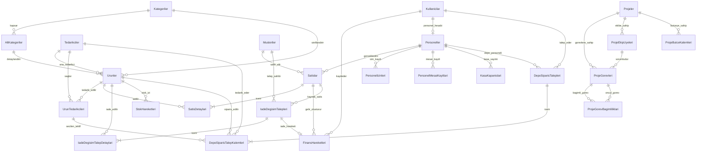

# Giyim Mağazası ERP - ER Diyagramı

Bu diyagram sistemin ana operasyonel tablolarını ve proje yönetimi tablolarını
özetler. Projede ayrı bir `Faturalar` tablosu bulunmaz; fatura numarası, seri,
tarih ve durum alanları `Satislar` tablosunda tutulur.

Proje yönetimi örnek verisi `21.05.2026 - 20.06.2026` tarih aralığını kullanır.
Bu aralık başlangıç ve bitiş günleri dahil 31 günlük teslim takvimidir.

## Ana İlişki Notları

- `Satislar` satış başlığı ve fatura alanlarını, `SatisDetaylari` ürün
  satırlarını tutar.
- `UrunTedarikcileri`, bir ürünün birden fazla tedarikçiyle maliyet ve teslim
  süresi bazında ilişkilendirilmesini sağlar.
- `IadeDegisimTalepleri` tamamlandığında ürün stokları ve ilgili
  `FinansHareketleri` kayıtları etkilenebilir.
- `Puantaj` ayrı bir tablo değildir; `PersonelIzinleri` ve
  `PersonelMesaiKayitlari` üzerinden anlık hesaplanan rapordur.
- `DepoSiparisTalepleri` yalnız teslim alma aşamasında `Urunler.StokMiktari`
  değerini artırır ve `StokHareketleri` kaydı oluşturur.
- `ProjeGorevBagimliliklari`, kritik yol ve bolluk süresi hesabında kullanılan
  görev öncüllerini saklar.
